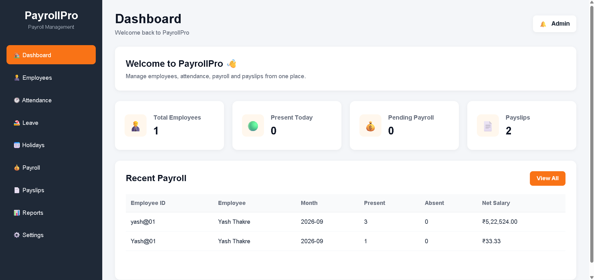
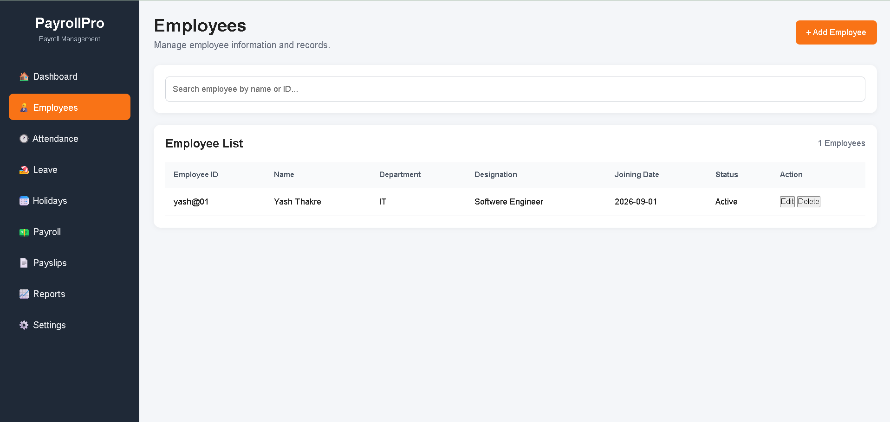
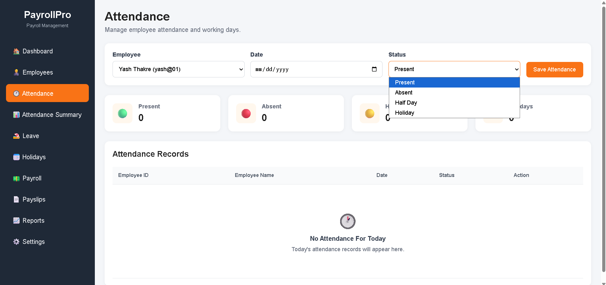
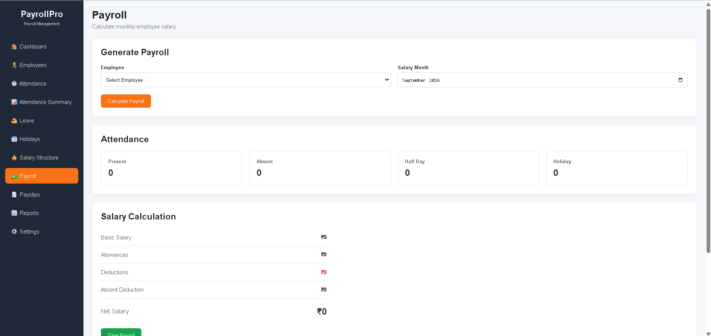
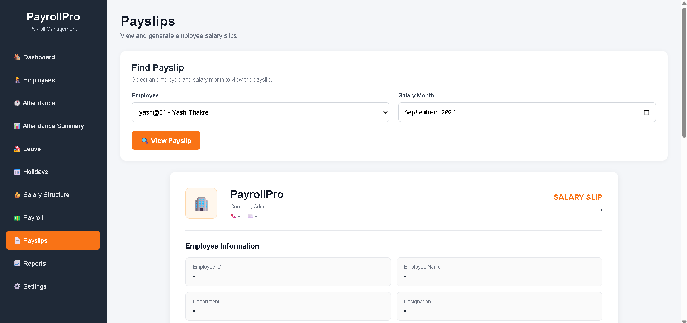

# 💼 PayrollPro – Employee Payroll Management System

PayrollPro is a web-based **Employee Payroll Management System** designed to simplify employee management, attendance tracking, salary calculation, payroll processing, and payslip generation.

The project focuses on making payroll-related tasks more organized, efficient, and easy to manage through a simple and professional interface.

---

## ✨ Features

* 👨‍💼 Employee Management
* 📅 Attendance Management
* 💰 Salary & Payroll Calculation
* 🧮 Automatic Salary Deductions
* 📊 Payroll Summary
* 🧾 Payslip Generation
* 📈 Reports Management
* 🌙 Clean and User-Friendly Interface
* 💾 Local Data Storage for Project Testing

---

## 🛠️ Technologies Used

### Frontend

* HTML5
* CSS3
* JavaScript

### Libraries & Tools

* jsPDF
* LocalStorage
* Git & GitHub
* Visual Studio Code

---

## 📸 Screenshots

### 🏠 Dashboard

The dashboard provides an overview of employees and payroll-related information.



### 👨‍💼 Employees

Manage employee information and maintain employee records in one place.



### 📅 Attendance

Track employee attendance including:

* Present
* Absent
* Half Day
* Holiday



### 💰 Payroll

Calculate employee salary based on salary structure and attendance records, including applicable deductions.



### 🧾 Payslip

PayrollPro can generate a professional PDF payslip containing employee details, salary components, deductions, and net salary.



📄 **View Sample Payslip:** [Open Sample Payslip](PayrollPro-ScreenShot/PayrollPro-Payslips.pdf)

---

## ⚙️ How PayrollPro Works

```text
Employee Details
       ↓
Salary Structure
       ↓
Attendance Records
       ↓
Payroll Calculation
       ↓
Salary Deductions
       ↓
Net Salary
       ↓
Payslip Generation
```

---

## 📂 Project Structure

```text
PayrollPro/
│
├── frontend/
│   ├── pages/
│   ├── css/
│   ├── js/
│   └── assets/
│
├── backend/
│   ├── config/
│   ├── controllers/
│   ├── middleware/
│   ├── models/
│   └── utils/
│
├── PayrollPro-ScreenShot/
│   ├── dashboard.png
│   ├── employees.png
│   ├── attendance.png
│   ├── payroll.png
│   ├── payslip.png
│   └── PayrollPro-Payslips.pdf
│
└── README.md
```

---

🚀 How to Run
1. Download or clone the repository.
2. Open the project in Visual Studio Code.
3. Open the main HTML file using Live Server.
4. Start managing employees, attendance, payroll, and payslips.

## 🔮 Future Improvements

* 🔐 User Authentication & Role-Based Access
* 🗄️ Database Integration
* ☁️ Cloud Deployment
* 📧 Email Payslip Delivery
* 📱 Improved Mobile Responsiveness
* 📊 Advanced Payroll Reports
* 🏢 Multi-Company Support

---

## 🎯 Project Purpose

PayrollPro was developed as a practical project to understand and implement a real-world payroll workflow involving **employee management, attendance, salary calculation, deductions, and payslip generation**.

---

## 👨‍💻 Developer

**Yash Thakre**

B.Tech Information Technology

* 💻 GitHub: [yashthakre05](https://github.com/yashthakre05)
* 🔗 LinkedIn: [Yash Thakre](YOUR_LINKEDIN_PROFILE_URL)

---

⭐ If you find this project useful, feel free to explore the repository and provide feedback.
